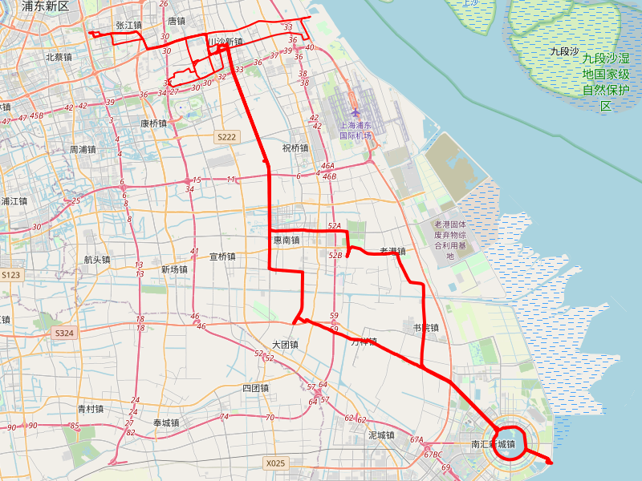

# btl

> beer's tools

```shell
go install github.com/yangyang5214/btl@latest 
```

## gist

Download the github gist to a local file, including images

```shell
btl gist <gist_id>
btl gist 7f903d466483c1dcfa62e131bcbb7917
```

## json2csv

json lines covert to CSV format

```shell
btl json2csv  -f xxx.json
```

## gpx_map

```
Usage:
  btl gpxMap [flags]

Flags:
  -a, --attribution string   
  -d, --dir string            (default ".")
  -f, --files strings        xx.gpx
  -h, --help                 help for gpxMap
  -n, --name string           (default "osm")
```

```
btl gpxMap ~/beer/rides
```

- 上海区域



- 全国区域


## json2mind/csv2mind

https://gist.github.com/yangyang5214/9b238a3d4a714bb8930404ddce3c5935

Group statistics json by inputs fields, then output mind map

### help

```
➜ btl json2mind -h
json lines file transform to md file, then convert to mind map

Usage:
  btl json2mind [flags]

Flags:
  -g, --fields strings     Fields that require group by
  -h, --help               help for json2mind
  -f, --json_file string   jsonlines file path
```

### usage

```shell
btl json2mind -f xxx.json -g field1,field2
```

### online markdown to mind map

https://markmap.js.org/repl

https://wanglin2.github.io/mind-map/#/